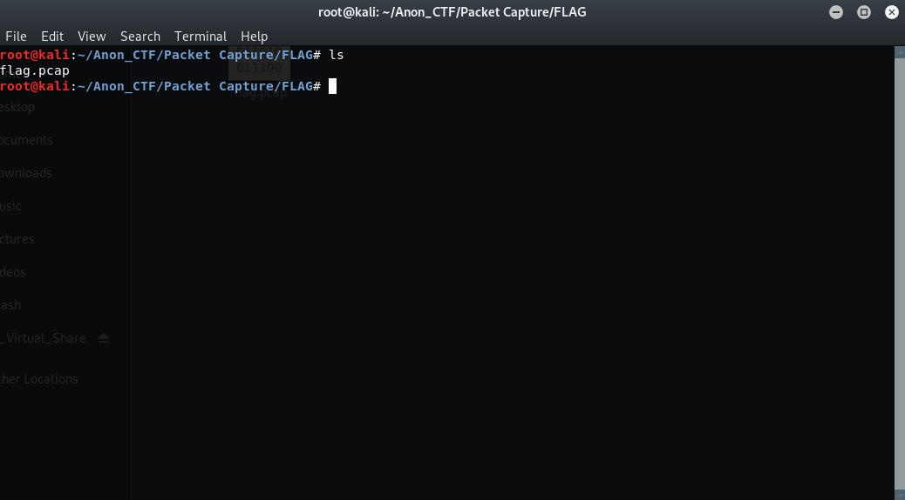

# AnonCTF_2019: A telephone Call

**Category:** Forensics
**Points:** 15

**Problem Statement:**

>Rick called Morty to tell him about a secret message which can save their earth C-137 to extint from an alien invasion.
The aliens tapped their conversation.
Can you find out what is that secret message?

<A href="https://drive.google.com/open?id=1FF2jcAmch00fUo23rmehSle5LLqHHJvl">Wabba_Lubba_Dub_Dub</A>

## Write-Up
There are many ways to solve this but im gonna go with the quickest one here. 
There is a tool called tcpflow which can extract all data transmitted in the tcp traffic be it raw data or multimedia data. 
Lets implement it. 

> 

> 

> 

> 

The flag here is <b>anonCTF{p@ck3t$_@r3_L1f3}</b>

