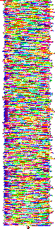

# AnonCTF_2019: Eight Circles of Hell

**Category:** Forensics
**Points:** 25

**Problem Statement:**

>It’s Star Wars time again, and you found a hidden message from R2D2, it supposedly can be decrypted of the Dark Force, help the Resistance to decode the message
>
> 

## Write-Up

The title has a hint towards the content of the strange image attached. 
Eight Circles of Hell is the name given to Malbolge after its crazy twisted
syntax.

The image is actually a code written in another esoteric language piet.

On passing the via a piet intepreter, we get the following output.

`RCdgJHFwIkp9fXtGeXk2L2V0MmJOTkwnLGwqaignZ2dle0FjP2A8eykoeHdZb3Rzcmsxb1FQbGtkKilKSWVkY2JbIUJYV1ZbWlN3V1ZVN1NSS29JSGxGLkpDQkdAZERDQiQjPzhcNnw6MzJWNjU0MzIxKnAoTG0lSSMiJ34lJHtBYn59dnV0OnhxWXV0bTNUcGluZ2xrZCpoZ2BIXiRiRFpfXl1WelRTWFdWVU5yTFFKT05NTEVEaEJBZShEQ0JBOl44PTw7NDkyVjA1LjMyK08vKC0sKyojRyEmfSR7ekB+d197enM5WnZvdG0zcXBvbm1mTitpS2dmZV4kXFtaWV5XXFV5U1hRdVVUU0xLbzJOR0ZqLUlIR0BkPkM8YCM/OFw8NXszVzc2djQzLCtPL28nLCskI0cnJmZlI3p5eD5fe3R5cjhZdW40bGtwaWguT2tkY2IoYGVeY1xbIUJeV1ZVeVlYOlBPVE1xUTMySEdMS0RoSCpGRT5iJUE6Pzg3Wzs0M1c3dzUuUixyMC8uLSwlSWooJ35EfHt6eT9gX3t0eXJ3cDZuc3JxcGkvbWxlamloZ2ZfXl0jYWBCQV1cW1R4WFdWOE5TUktKbjFNTEtKQ2dBRkVEPWEkOj8+PTw1NFg4eDYvU3RzMTApTS0sbGsjRycmJXxkInk/YF91dHM5d3ZYdG1sazFvbm1sZU0qdQ==`

The == at the end cleary point to it being a base64 encoded string.

Decrypting it using base64 decryptor we get an output which is in Malbolge.
Use any Malbolge interpreter to execute it and get the flag string `dafuck_how_did_you_find_this!`

Append it to the usual flag format

The Flag is `anonCTF{dafuck_how_did_you_find_this!}`
