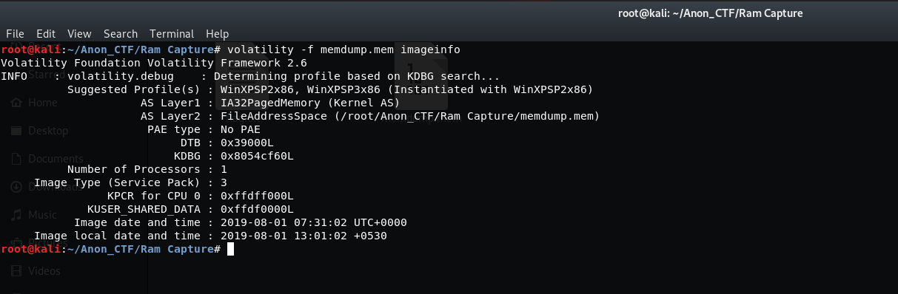

# AnonCTF_2019: Ram into me

**Category:** Forensics
**Points:** 20

**Problem Statement:**
>
Asta was behaving weird quite lately and used to stick into his computer all day-in and out.Yuno is an excellent hacker and being a good friend of Asta worried for him.He took the ram-dump of Asta's computer to find out what he's been doing in his computer? Can you help Yuno find, what is in the ram-dump?

><A href="https://drive.google.com/drive/folders/1hLNtA_XvuAaERG3m6RpuoodILEBFJEbs?usp=sharing">RAM DUMP</A>

## Write-Up
Download the file <B>memdump.mem</B>. 
There's a tool called volatility which can analyze the memory dump. 
You can run the following command for more info.
>
$ volatility -h

<h4>STEP 1</h4>

> First lets analyze on  what type of system image has been taken 
   
   

It shows profile as <B>WinXPSP2x86</B> , keep that in mind

<h4>STEP 2</h>

> Lets see what are the running processes in the system
  
  
